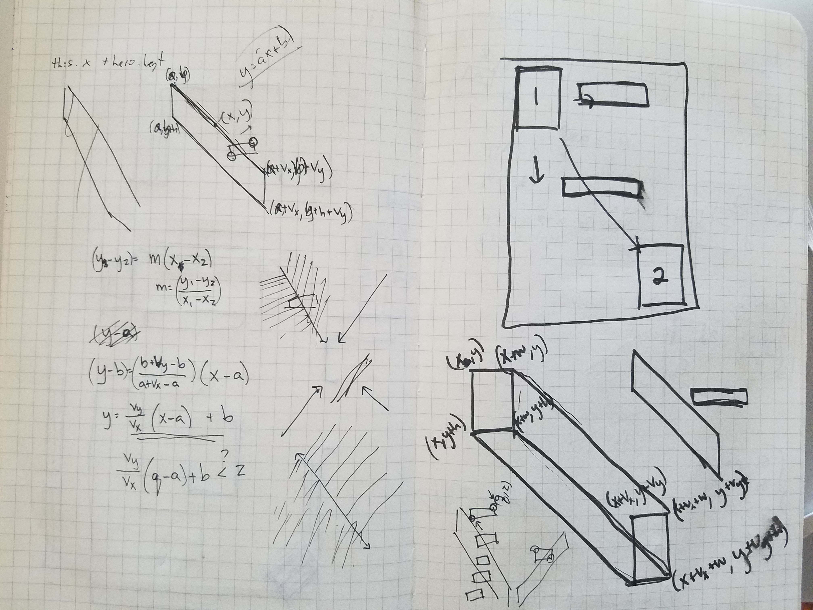

# Down Beat

[Down Beat live][githubpages]

[githubpages]: https://mooserson.github.io/DownBeat/

### A Sisyphean Task
Downbeat is a game written in javascript using the easelJS library.
If challenges the player to explore a dangerous landscape and to triumph over a seemingly absurd and insurmountable task.

### Challenge
The challenge of calculating collisions became a big focus of the work on this project. The hero has velocity meaning she will move more than one pixel per frame. It is necessary to check and see if:
- 1) If the hero will pass through a platform in the next frame
- 2) Where the hero should land

### Features Ahead
- 1) Include music that would sync in speed with the motion of the platforms
- 2) Viewport follows hero
