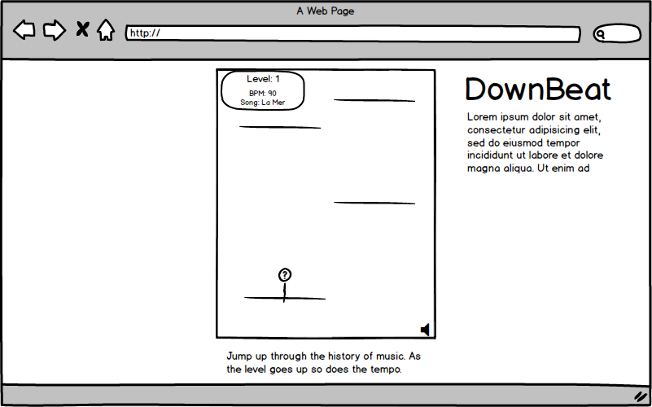

# Down Beat

### A Music-synced Platformer

Down beat will generate platforms for the player to jump on to escape. The platforms will drop in sync to music that will slowly increase in speed. The player will benefit by jumping in time to the music.

### MVPs--Goals for the project

The features for a minimum-viable-product were:

- [ ] A canvas-based platformer game
- [ ] Game speeds up in time to music
- [ ] Player controls are responsive and feel fun to user
- [ ] User Pages
- [ ] A README will be included

### Wireframe:

The game will be on a single page site. It will include a github link, a title, a brief description and basic gameplay instruction.

### Architecture and Technologies

The game will run on JavaScript using the AudioContext api.
  -Easel JS will help streamline using the HTML5 Canvas implementation for rendering.
  -Sound JS will likely help manage audio to sync with gameplay.
  -Webpack to package scripts.

  player.js Will handle the player logic. It will handle movement for the player's character, behavior and animation.

### Timeline

**Day 1**: Complete configuration including webpack, and installing the necessary libraries. Create a package.json file. Figure out what other libraries will be useful. Get rendering objects and look into dynamic audio playback.

- Webpack set up with entry file
- Libraries installed
- Architecture skeleton defined
- Begin learning Easel

**Day 2**: Work through enough Easel documentation to be able to render and begin animating objects.

- Set up a canvas and get character to render.
- Begin getting character to move.
- Scope out the next steps for rendering with music.

**Day 3**: Work on character movement and platforms. Finish character control and begin working on platform generation and collision with character.

- Set up keyboard controls for jumping and running.
- Get character sprite/animation working.
- Create platform objects and character interaction with them.
  - Platforms generate at dynamic rate.
  - Character can jump from platform to platform.
- Music plays in game.

**Day 4**: Tie in music with platforms. Handle the UI. Style and build out the page.

- Have multiple classical piano songs that increase in tempo
- UI shows height/level/music speed
- Mute button for music
- Have the game splash and game-over pages complete.
- Make page look clean and finish descriptions.

### Bonus features

More variety in game-play. User-uploaded songs. Having events and changing backgrounds.

- I would like to add items to effect player's movement speed. Spring boards and other boosters.
- More engaging animation and sound effects.
- Events or other characters to meet along the way up, maybe a story.
- Backgrounds that slowly will change depending on height and level.
